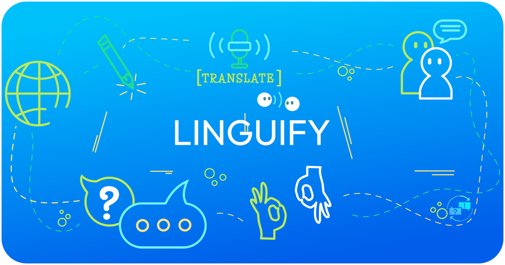



# Linguify - Language Detector API

Welcome to **Linguify - Language Detector API**—your one-stop, high-performance solution for all your language detection and translation needs! Linguify makes it easy for developers, businesses, and creators to integrate multilingual capabilities into their applications with speed, precision, and flexibility.

Linguify is crafted to elevate your app's global reach, allowing users from diverse language backgrounds to engage with ease. Whether you're looking to detect the language of input text, translate text between languages, or seamlessly auto-detect and translate, Linguify has you covered.

## Features

* **Accurate Language Detection**: Identify the language of any input text with high accuracy and receive probability scores for confident decision-making.
* **Robust Text Translation**: Translate between languages effortlessly with our reliable translation endpoint.
* **Auto-Translation with Detection**: Detect the language of input text automatically and translate it to the desired target language in one smooth step, reducing user input and enhancing experience.

## Why Choose Linguify?

* **Efficient**: Built with speed and scalability in mind, Linguify performs reliably even under high loads.
* **User-Friendly**: With simple endpoints and clear parameters, integrating Linguify into your projects is as easy as it gets.
* **Global Ready**: Serve users worldwide and break down language barriers with our powerful multilingual support.

## Endpoints

1. **/detect** Detects the language of input text and returns probability scores to indicate accuracy levels.
2. **/translate** Translate text between languages of your choice. You specify the `from` and `to` languages—Linguify handles the rest.
3. **/auto-translate** Auto-detects the language of the input text and translates it to the specified target language, returning both the detected language and translation in one response.

## Get Started

* **Explore the Documentation**: Comprehensive details on integrating and using each endpoint can be found here.
* **Subscribe on RapidAPI**: Try Linguify for free and unlock advanced features by subscribing on RapidAPI.

## Perfect For

* Developers seeking to build multilingual apps
* E-commerce platforms expanding to new markets
* Content creators localizing for global audiences
* Customer service platforms with a global user base

## Ready to Get Started?

Linguify is ready to support your vision. Try the API today, and empower your users to communicate without language barriers!

### Links
- **GitHub Repository**: [Linguify - Language Detector API](https://github.com/dakidarts/linguify-language-detector-api/)
- **Documentation**: [Linguify API Documentation](https://dakidarts.com/api/linguify-language-detector-api/)
- **RapidAPI**: [Linguify on RapidAPI](https://rapidapi.com/kidddevs/api/linguify-language-detector-api)